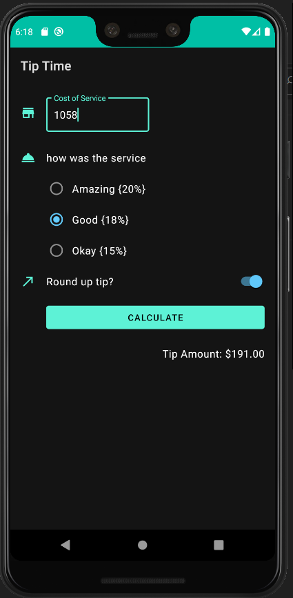

# Tip-Time

### Tip-Time is an android application:
* __It allows users to calculate tip based on your satisfaction to the service provided__
* __It follows material design standards to provide visually aesthetic designs and delivers the best UI-UX to the user.__

### Minimum Requirements
* __Android version 4.4__

<table width="100%">
  <tr>
     <td>
       <h5>Light Mode</h5>
       
     </td>
     <td style="text-align:left;">
       <h5>Dark Mode</h5>
       
     </td>
  </tr>
</table>
